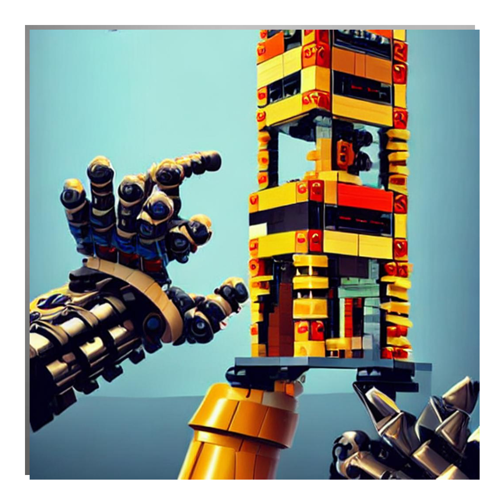

# Manufacturing Robotics Challenge @ ICRA
Welcome to the Manufacturing Robotics Challenge @ ICRA official repo! Here you will find all the information, files, instructions you need to participate in this challenge. 
Your task for the next 2 days will be to use collaborative robots to build the biggest _Jenga_ tower!
Each team will be provided with a collaborative robot, a gripper, and a 3D camera. The rules for the challenge can be found below. 

## Rules and assessment.
- Use the provided collaborative robot to build the tallest Jenga tower. The team with the tallest tower wins
- The tower will be measured at the end of the challenge and will have to stand for at least 1 minute
- Bonus points:
  - Different types of bricks are provided to build the tower. Extra points will be assigned if the team makes use of the RGB camera to detect and avoid red pieces (20% added to the final height)
  - Extra points will be assigned if the team can prove the use of the 3D camera to autonomously detect the position and orientation of the bricks. (30% added to the final height)
  - The bricks can be used to build a sculpture. A sculpture score from 1 to 3 will be assigned to every tower. The final height of the tower is multiplied by the
sculpture score. The scores are assigned according to the artistic value and structural integrity of the sculpture.

# Fair Play
All teams are required to exhibit fair play and cooperative conduct throughout the entire competition. This encompasses the following expectations:
- Refraining from engaging in cheating, such as pretending to have autonomous behavior when it does not exist or manually building the towers by hand when the organisers are not watching
- Forcing other team's towers to collapse
- Behaving appropriately and maintaining respectful interactions with other teams and participants.
Failure to adhere to these guidelines will result in penalties, including negative scores and potential disqualification from the entire competition

## Technical Rules 
- Before using the robots the Risk Assessment needs to be signed and agreed by everyone. Robots can be dangerous and cause injuries so please carefully follow the instructions of the organisers.
- Care must be taken when controlling the robots. The robots will be slowed down to reduce the risk of collision. Collisions which could have been avoided will result in the team being disqualified from the competition. 
- ROS shall be used to control the robots, grippers, and cameras. Instructions will be provided on the day on how to control the robots and grippers. However, if you have never used ROS before, you might find this resources useful.
  - [ROS Basics Tutorial](https://www.youtube.com/watch?v=Qk4vLFhvfbI&list=PLLSegLrePWgIbIrA4iehUQ-impvIXdd9Q)
  - [Moveit! Tutorial - python](http://docs.ros.org/en/melodic/api/moveit_tutorials/html/doc/move_group_python_interface/move_group_python_interface_tutorial.html)
- You can use any language supported by ROS but we reccomend using python as it requires the least amount of setting up
- If you are using your own machine please follow the instructions below to [Set up your Ubuntu Machine](docs/MachineSetup)

