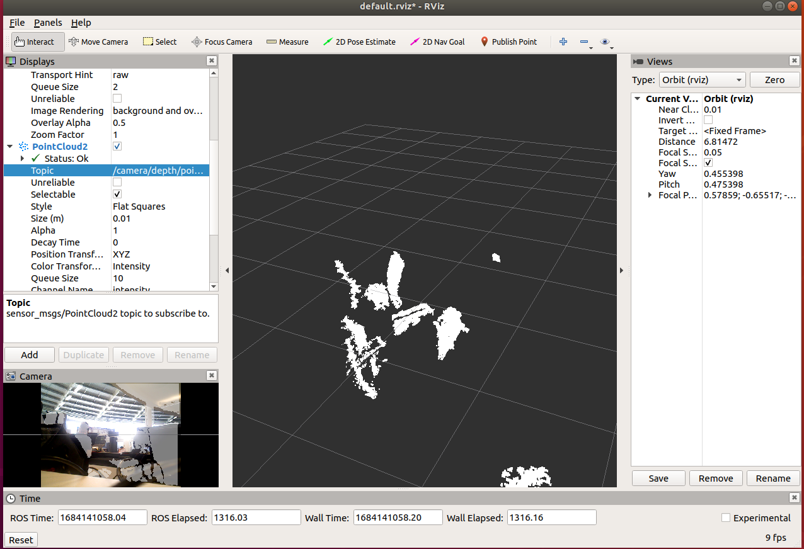
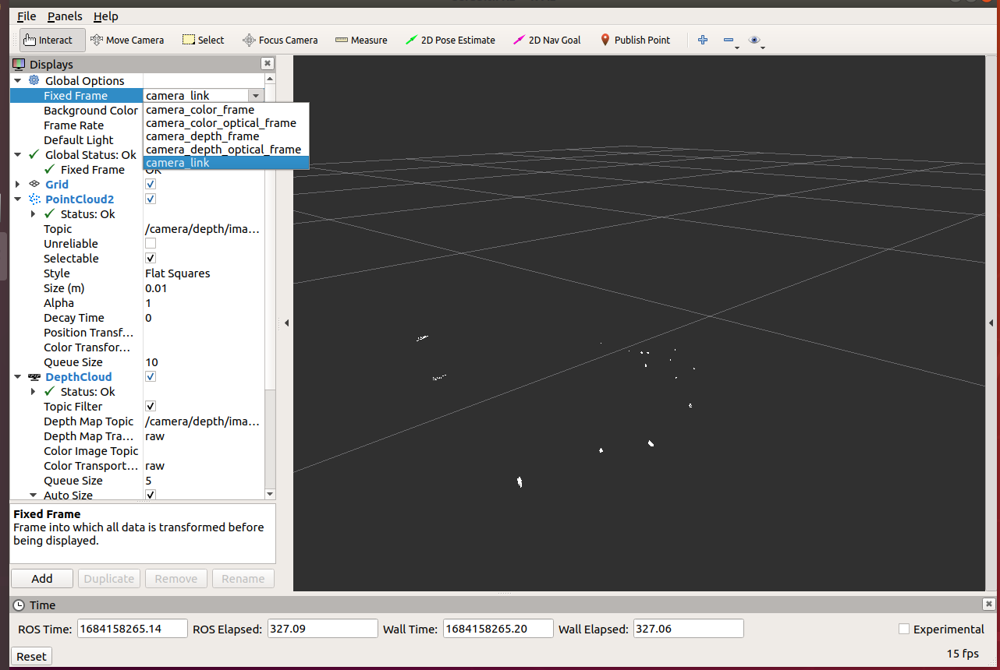
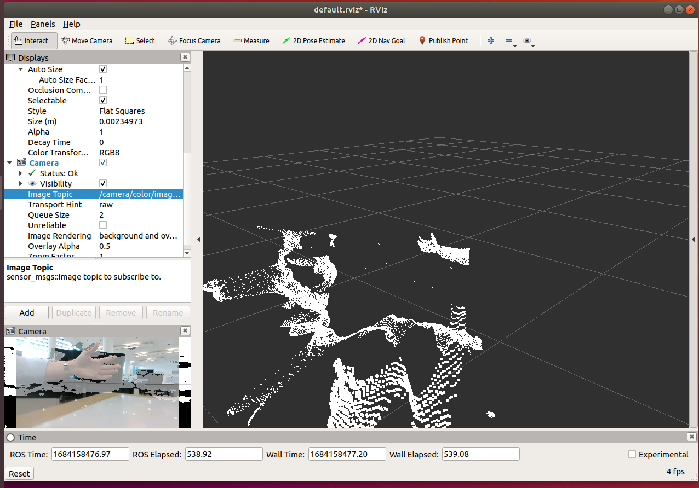

# Set up of Ubuntu 18 machine
This set of instructions will guide you to set up your Ubuntu 18 machine for the Manufacturing Robotics Challenge. The main steps to follow are shown below:
- [Install ROS melodic](#install-ros)
- [Install VS code](#install-vs-code)
- [Clone and build the iiwa-stack ROS library](#clone-and-build-the-iiwa-stack)
- [Install the camera drivers](#install-the-camera-drivers)
- [Install the find-object package](#install-the-find-object-package)
## Install ROS
You first need to install ROS melodic. [Follow these instructions to do so](http://wiki.ros.org/melodic/Installation/Ubuntu).

## Install VS Code
To install Visual Studio Code on your Ubuntu system, follow these steps:

First, update the packages index and install the dependencies by typing:
```
sudo apt update
sudo apt install gnupg2 software-properties-common apt-transport-https wget
```
Next, import the Microsoft GPG key using the following wget command :
```
wget -q https://packages.microsoft.com/keys/microsoft.asc -O- | sudo apt-key add -
```
And enable the Visual Studio Code repository by typing:
```
sudo add-apt-repository "deb [arch=amd64] https://packages.microsoft.com/repos/vscode stable main"
```
Once the apt repository is enabled , install the latest version of Visual Studio Code with:
```
sudo apt update
sudo apt install code
```
That’s it. Visual Studio Code has been installed on your Ubuntu desktop and you can start using it.

### Install Live Share
In order to aid collaboration within the team we suggest installing the Live Share extension. Open VS Code, by typing `code` in a terminal, click on the extension icon, and in the search bar type Live Share. Locate it in the list of results and click the install button on the right corner. 

More information on how to use LiveShare can be found [here](https://code.visualstudio.com/learn/collaboration/live-share)

## Clone and build the iiwa-stack
In order to control the robots with ROS we need to install the ROS drivers. We will be using 4 KUKA iiwa and there are several ROS packages that allow to control them. We will be using a modified version of the [iiwa-stack](https://github.com/IFL-CAMP/iiwa_stack)
You first need to create a workspace. You can use your own if you have one, but we reccomend using a new one to avoid conflicts. First create a new folder:
```
mkdir -p mrc_icra_ws/src
```
Then we need to initialise the workspace:
```
cd ~/mrc_icra_ws
catkin_init_workspace 
```
Now go to the src folder and clone the challenge repo:
```
cd ~/mrc_icra_ws/src
git clone https://github.com/gianmarco96/MRC-at-ICRA
```
This is optional but we would suggest removing the unnecessary files:
```
mv MRC-at-ICRA/iiwa_stack-master/ .
rm -fr MRC-at-ICRA/
```
Now you can build the worksapce
```
cd ~/mrc_icra_ws
rosdep install --from-paths src --ignore-src -r -y
catkin build
```
If you get the error `catkin: command not found`, it just means you have not installed the catkin tools yet. You can do so by `sudo apt install ros-melodic-catkin python-catkin-tools`. Then you should be able to run the `catkin build` command.
Don't forget to 'activate' the build you need to source the workspace every time you open a new terminal
```
source devel/setup.bash
```
**Note:** If you do not want to source the environment every time you can add the following line to the .bashrc. Simply copy-paste the below to a terminal window
```
echo 'source ~/mrc_icra_ws/devel/setup.bash' >> ~/.bashrc
``` 

## Install the camera drivers
There are 3 cameras that will be used during this challenge. Each group will be using only one type, so you might want to wait until you know which camera has been assigned to you before you carry on with this setup.
- [ASUS Xtion Pro](#asus-xtion-pro)
- [Realsense camera](#realsense)
- [Microsoft Azure Kinect](#microsoft-azure-kinect)
### Asus Xtion Pro
Open a new terminal (tip: you can press Ctrl + Alt + T) and copy-paste the following command:
```
sudo apt install ros-melodic-openni2-*
```
**Note:** The above assumes you have run `sudo apt update` during the installation of ROS, if you have not please do so before installing the camera driver.
To test the camera has installed correctly, connect the ASUS Xtion camera to your laptop, open a new terminal and run the following
```
roslaunch openni2_launch openni2.launch
```
Then open Rviz
```
rviz
```
Select camera_link_ as the Fixed Frame. Then click on Add, find the Camera type select it and click OK


A new Camera type object will appera on the Displays panel, expand it and select /camera/rgb/image_raw from the Image Topic. The rgb camera feed should now appera in the Camera box. 
To test the depth image, click on Add again, and select PoinCloud2. A new PointCloud2 object will be generated, expand it and select /camera/depth/points as the Topic. You should now see the point cloud in the RViz environment.



### RealSense 
Open a new terminal (tip: you can press Ctrl + Alt + T) and copy-paste the following command:
```
sudo apt install ros-melodic-realsense2-camera
```
**Note:** The above assumes you have run `sudo apt update` during the installation of ROS, if you have not please do so before installing the camera driver.
To test the camera has installed correctly, connect the realsense camera to your laptop, open a new terminal and run the following
```
roslaunch realsense2_camera rs_camera.launch device_type:=d435i
```
Then open Rviz
```
rviz
```
Select camera_link_ as the Fixed Frame. Then click on Add, find the Camera type select it and click OK



A new Camera type object will appera on the Displays panel, expand it and select /camera/color/image_raw from the Image Topic. The rgb camera feed should now appera in the Camera box. 
To test the depth image, click on Add again, and select DepthCloud. A new DepthCloud object will be generated, expand it and select /camera/depth/image_raw_rect as the Depth Map Topic. You should now see the point cloud in the RViz environment.



### Microsoft Azure Kinect
This one takes a bit longer to install and set up so please follow these instructions carefully. You first need to install the Azure Kinect SDK. These instructions assume you are using an AMD64 system (which is quite likely), if you are using a different system please refer to the official [Microsoft Installation Guide](https://github.com/microsoft/Azure-Kinect-Sensor-SDK/blob/develop/docs/usage.md#debian-package). To check your system is an AMD64 simply run 'lscpu' and make sure your CPU op-mode include 64-bit. Now you can run the following commands on a new terminal (tip: you can press Ctrl + Alt + T) 
```
curl https://packages.microsoft.com/keys/microsoft.asc | sudo apt-key add -
sudo apt-add-repository https://packages.microsoft.com/ubuntu/18.04/prod
sudo apt update
```
If you get this error `N: Skipping acquire of configured file 'main/binary-i386/Packages' as repository 'https://packages.microsoft.com/ubuntu/18.04/prod' doesn't support support architecture 'i386'` it means you need specify the architecture of the repository to [arch=amd64]:
Log in as root:
```
sudo -i
```
Modify /etc/apt/sources.list. You can use nano, vim, vs code or any other IDE. At the bottom of the file, change from:
```
deb https://packages.microsoft.com/ubuntu/18.04/prod bionic main
# deb-src https://packages.microsoft.com/ubuntu/18.04/prod bionic main
```
to:
```
deb [arch=amd64] https://packages.microsoft.com/ubuntu/18.04/prod bionic main
# deb-src [arch=amd64] https://packages.microsoft.com/ubuntu/18.04/prod bionic main
```
and save.
Log out of root:
```
exit
```
Rerun `sudo apt update`
Now you can install the Kinect packages 
```

sudo apt install k4a-tools=1.3.0
sudo apt install libk4a1.3-dev
```
Now we need to set up the udev rules. Create a 
```
cd /etc/udev/rules.d/
sudo touch 99-k4a.rules
```
Open the file in VS code
```
code 99-k4a.rules
```
and copy-paste this code:
```
# Bus 002 Device 116: ID 045e:097a Microsoft Corp.  - Generic Superspeed USB Hub
# Bus 001 Device 015: ID 045e:097b Microsoft Corp.  - Generic USB Hub
# Bus 002 Device 118: ID 045e:097c Microsoft Corp.  - Azure Kinect Depth Camera
# Bus 002 Device 117: ID 045e:097d Microsoft Corp.  - Azure Kinect 4K Camera
# Bus 001 Device 016: ID 045e:097e Microsoft Corp.  - Azure Kinect Microphone Array

BUS!="usb", ACTION!="add", SUBSYSTEM!=="usb_device", GOTO="k4a_logic_rules_end"

ATTRS{idVendor}=="045e", ATTRS{idProduct}=="097a", MODE="0666", GROUP="plugdev"
ATTRS{idVendor}=="045e", ATTRS{idProduct}=="097b", MODE="0666", GROUP="plugdev"
ATTRS{idVendor}=="045e", ATTRS{idProduct}=="097c", MODE="0666", GROUP="plugdev"
ATTRS{idVendor}=="045e", ATTRS{idProduct}=="097d", MODE="0666", GROUP="plugdev"
ATTRS{idVendor}=="045e", ATTRS{idProduct}=="097e", MODE="0666", GROUP="plugdev"

LABEL="k4a_logic_rules_end"
```
Save and exit. 

You are finally ready to install the ROS drivers. The easiest way is to clone the source file into your ROS workspace and build.
```
cd ~/mrc_icra_ws/src
git clone https://github.com/microsoft/Azure_Kinect_ROS_Driver
cd ..
catkin build
```
Don't forget to source the workspace `source ~/mrc_icra_ws/devel/setup.bash`.
## Install the Find Object Package
To install the package run the following 
```
sudo apt install ros-melodic-find-object-2d
```
You are done with the installation. Before launching the application you need to check the model of the camera your using. By default, the application subscribes to the '/camera/rgb/image_rect_color' for the rgb image,  '/camera/depth_registered/image_raw' for the depth image and  '/camera/rgb/camera_info' for the camera metadata. Each camera driver uses a slightly different naming for their topics so you will have to remap to the correct one. To see which one is the correct topic, launch the camera driver first then check the avalible topics with 'rostopic list' and note down the name of the topic. Below, you can find an example with the Xtion Pro Camera drive
```
# First we launch the camera driver
roslaunch realsense2_camera rs_camera.launch device_type:=d435i
# Then we open a new terminal and check the available topics
rostopic list
``` 
You will get something similar to this: 
```
/camera/color/camera_info
/camera/color/image_raw
/camera/color/image_raw/compressed
/camera/color/image_raw/compressed/parameter_descriptions
/camera/color/image_raw/compressed/parameter_updates
/camera/color/image_raw/compressedDepth
/camera/color/image_raw/compressedDepth/parameter_descriptions
/camera/color/image_raw/compressedDepth/parameter_updates
/camera/color/image_raw/theora
/camera/color/image_raw/theora/parameter_descriptions
/camera/color/image_raw/theora/parameter_updates
/camera/color/metadata
/camera/depth/camera_info
/camera/depth/image_rect_raw
/camera/depth/image_rect_raw/compressed
/camera/depth/image_rect_raw/compressed/parameter_descriptions
/camera/depth/image_rect_raw/compressed/parameter_updates
/camera/depth/image_rect_raw/compressedDepth
/camera/depth/image_rect_raw/compressedDepth/parameter_descriptions
/camera/depth/image_rect_raw/compressedDepth/parameter_updates
/camera/depth/image_rect_raw/theora
/camera/depth/image_rect_raw/theora/parameter_descriptions
/camera/depth/image_rect_raw/theora/parameter_updates
/camera/depth/metadata
/camera/extrinsics/depth_to_color
/camera/motion_module/parameter_descriptions
/camera/motion_module/parameter_updates
/camera/realsense2_camera_manager/bond
/camera/rgb_camera/auto_exposure_roi/parameter_descriptions
/camera/rgb_camera/auto_exposure_roi/parameter_updates
/camera/rgb_camera/parameter_descriptions
/camera/rgb_camera/parameter_updates
/camera/stereo_module/auto_exposure_roi/parameter_descriptions
/camera/stereo_module/auto_exposure_roi/parameter_updates
/camera/stereo_module/parameter_descriptions
/camera/stereo_module/parameter_updates
/diagnostics
/rosout
/rosout_agg
/tf
/tf_static
```
So you should run the following command:
```
roslaunch find_object_2d find_object_3d.launch rgb_topic:=/camera/color/image_raw depth_topic:=/camera/depth/image_rect_raw camera_info_topic:=/camera/depth/camera_info
```
More info on how to use the find_object_2d package can be found [here](http://wiki.ros.org/find_object_2d)