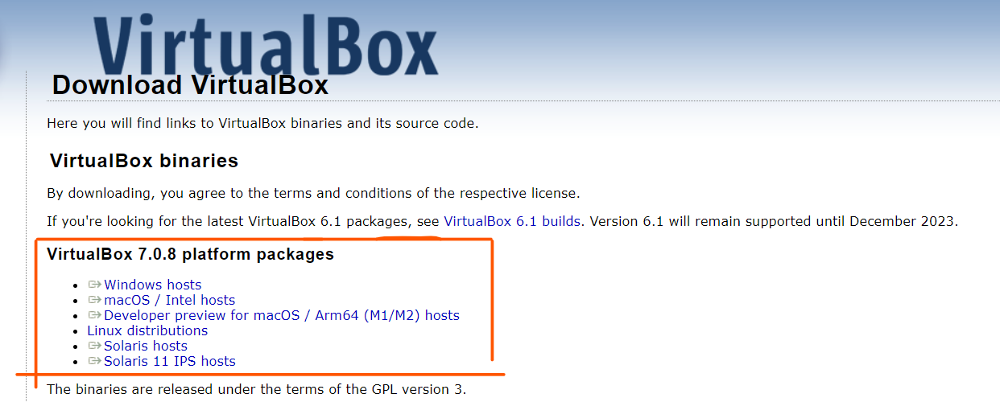
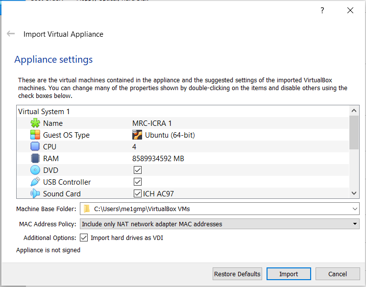

# Instructions to set up VM
- Install VirtualBox following this link and select the right version accordion to your operating system: https://www.virtualbox.org/wiki/Downloads

- Once VirtualBox is installed, download the ova file (https://drive.google.com/file/d/1g0XNztTsAcZdYUQSZr6nftOegRRDPGJF/view?usp=sharing) and double-click on it. You will be presented with a Window similar to the below. Feel free to amend the settings to your machines power but be aware that the current settings are the minimum we recommend for a smooth experience

- Click on Import and wait for the import to be completed. Once this is done, simply select the Image that has just been created (MRC-ICRA) and Run it. Once the system boots up you will be asked for a password. The password is: mrc-icra